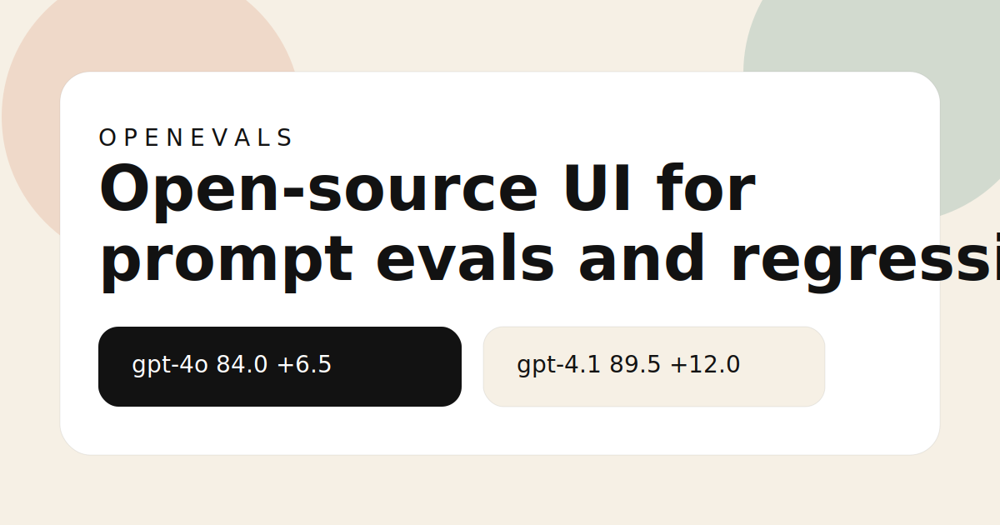

# OpenEvals



OpenEvals is an open-source React + FastAPI studio for running prompt evals, comparing models side by side, pinning a baseline, and shipping the same suite in GitHub Actions.

It is designed for public OSS adoption:

- Beautiful compare screens that are screenshot-friendly
- Git-tracked YAML suites that fork cleanly
- OpenAI-first runner for `gpt-4o`, `gpt-4.1`, and `gpt-4.1-mini`
- Regression deltas against a pinned baseline
- Generated GitHub Actions workflow plus a reusable `openevals` CLI

## Stack

- Frontend: React, TypeScript, Vite, TanStack Router, TanStack Query, Tailwind, Radix, CodeMirror
- Backend: FastAPI, Pydantic v2, SQLAlchemy, PostgreSQL, Redis, Dramatiq
- Runner: shared Python package used by the API and CLI

## Quickstart

1. Copy `.env.example` to `.env`.
2. Start infrastructure:

   ```bash
   docker compose up postgres redis
   ```

3. Install dependencies:

   ```bash
   make setup
   ```

4. Run the app:

   ```bash
   make backend
   make worker
   make frontend
   ```

5. Open [http://localhost:5173](http://localhost:5173).

## What works today

- Create a suite from starter YAML or import one from GitHub
- Save versioned suite revisions in the backend
- Run one or two OpenAI models against a suite
- Compare per-case outputs, assertions, and judge notes
- Pin a run as the baseline and inspect regression counts
- Export the suite YAML and a GitHub Actions workflow
- Upload CI results back into the app with an API token

## Repo layout

- `frontend/`: React app
- `backend/openevals_api`: FastAPI app and worker wiring
- `backend/openevals_runner`: shared runner and CLI
- `examples/suites/`: public example eval suites

## CLI

Run a suite locally:

```bash
cd backend
uv run openevals run ../examples/suites/support-routing.yaml \
  --model gpt-4o \
  --model gpt-4.1 \
  --output openevals-results.json \
  --junit openevals-junit.xml
```

## Making this public

- MIT licensed
- `CODE_OF_CONDUCT.md`, `CONTRIBUTING.md`, issue templates, and CI included
- Launch checklist in [docs/launch-playbook.md](./docs/launch-playbook.md)

## Status

This is an MVP scaffold aimed at the first public release. The core product loop is in place, but production hardening, auth, and a hosted suite gallery are intentionally out of scope for `v0.1`.
